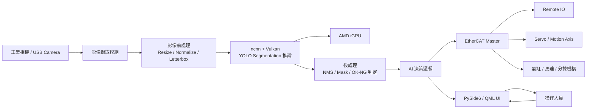
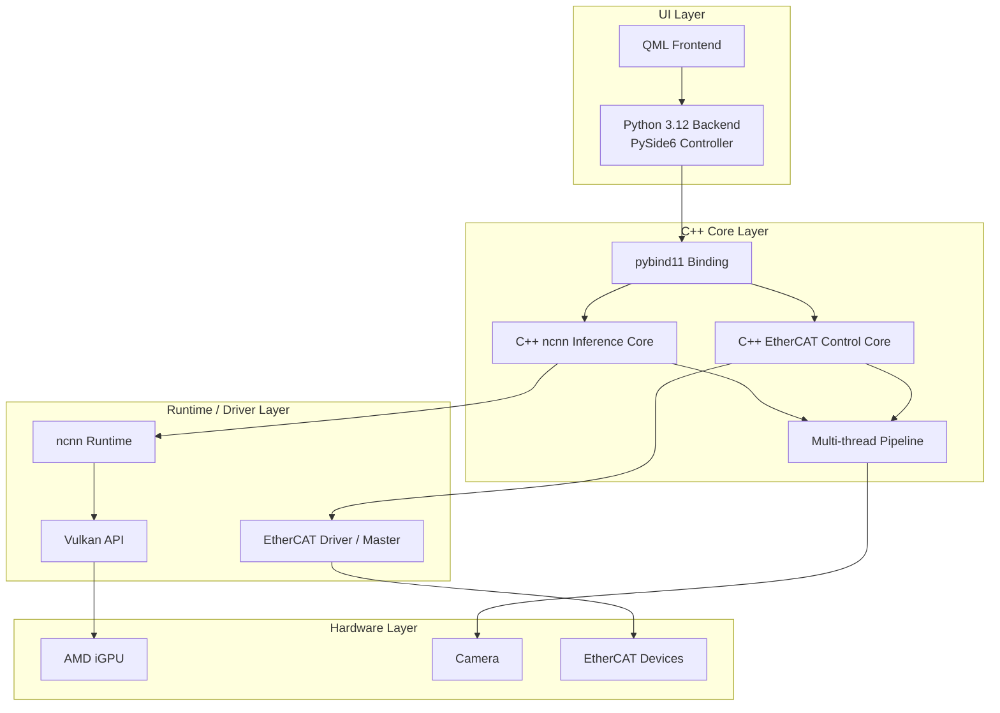
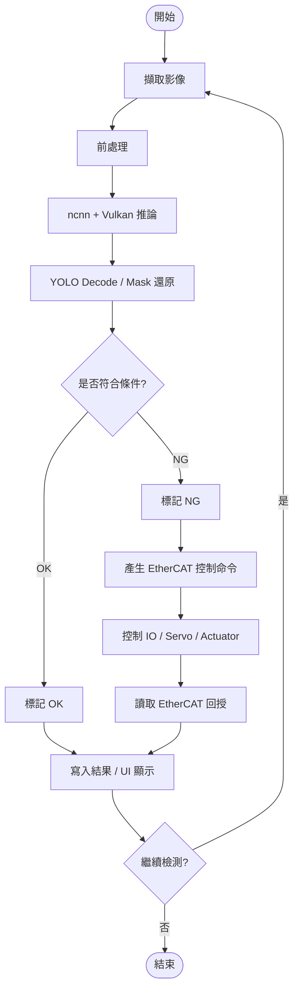
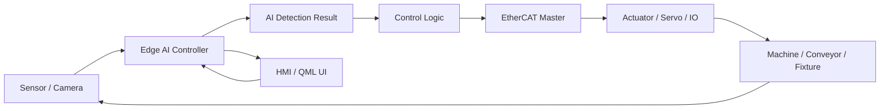
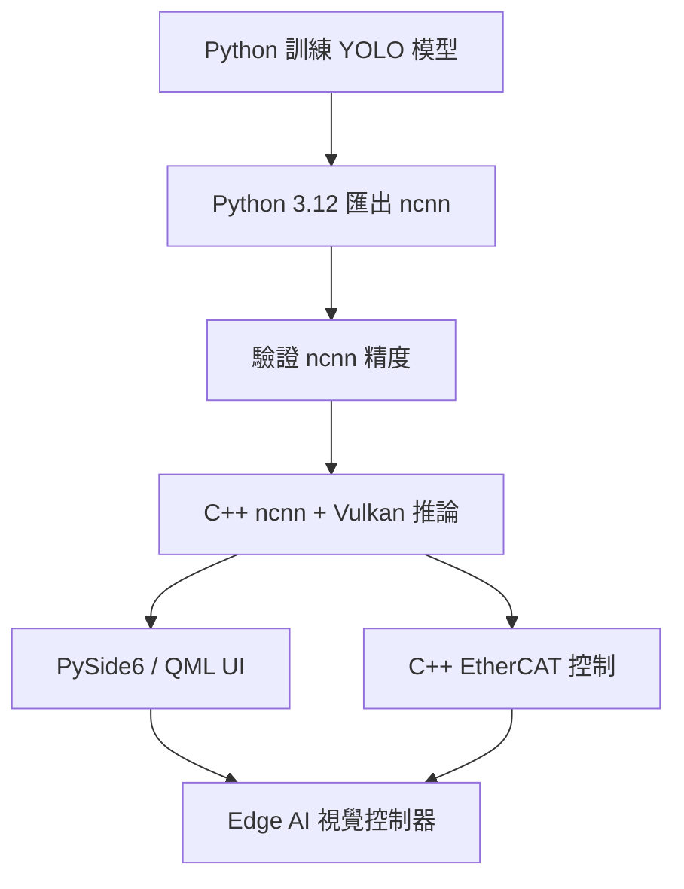
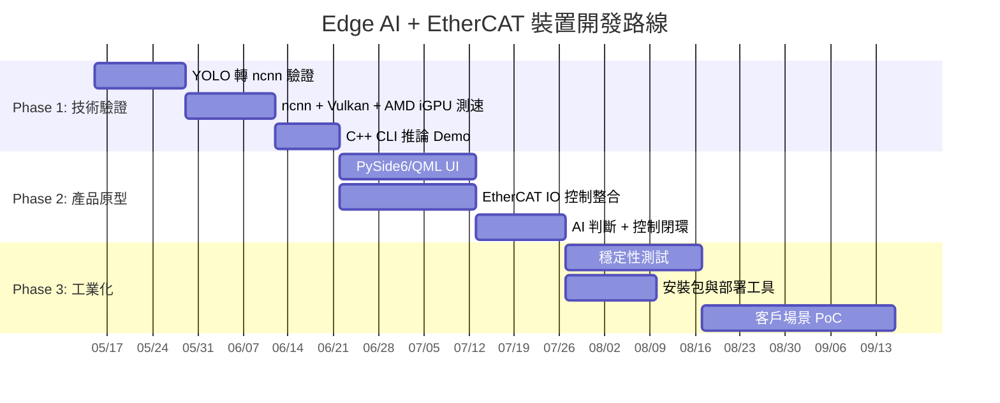

# iGPU + ncnn + EtherCAT Edge AI 裝置提案

## 低成本視覺 AI 推論 + 即時運動/IO 控制整合方案

**報告對象：總經理**  
**目的：評估將 Edge AI 視覺檢測與 EtherCAT 控制整合為可商品化裝置的可行性**

---

# 1. 核心結論

我們建議開發一台整合式 Edge AI 裝置：

- 使用 **AMD iGPU + ncnn + Vulkan** 做低成本 AI 推論
- 使用 **YOLO Segmentation / Detection** 做視覺辨識與瑕疵檢測
- 使用 **EtherCAT** 做即時控制、IO、伺服與產線設備整合
- 使用 **PySide6 / QML** 建立工業化操作 UI
- 使用 **C++** 實作高效能推論與控制核心

> 這是一個「低成本 AI 視覺控制器」，不是單純 AI demo。

---

# 2. 為什麼值得做？

## 對公司價值

- 降低對 NVIDIA GPU / 高價 AI 加速卡的依賴
- 可形成自有 Edge AI 控制器產品
- 可整合既有自動化、視覺、控制、通訊能力
- 有機會成為公司未來智慧設備的標準平台

## 對客戶價值

- 成本低於獨立 GPU 工控機
- 體積小、功耗低、部署簡單
- 可直接連接現場 EtherCAT 設備
- AI 判斷結果可立即轉成控制命令

---

# 3. 產品定位

| 項目 | 定位 |
|---|---|
| 產品類型 | Edge AI 視覺控制器 |
| 主要任務 | 視覺檢測、瑕疵辨識、分類、定位、分割 |
| 推論硬體 | AMD Ryzen APU / iGPU |
| AI Runtime | ncnn + Vulkan |
| 控制通訊 | EtherCAT |
| UI | PySide6 / QML |
| 核心語言 | C++ + Python 3.12 |
| 目標市場 | AOI、產線檢測、機台視覺、智慧自動化 |

---

# 4. 系統總體架構圖

---

# 5. 軟體架構圖

---

# 6. AI 推論與控制流程圖

---

# 7. 為什麼選 iGPU + ncnn？

## 技術理由

- ncnn 支援 Vulkan，不依賴 CUDA
- AMD iGPU 可透過 Vulkan 參與推論
- ncnn 適合 Edge / Mobile / Embedded 推論
- C++ 部署輕量、可控、容易整合工業通訊

## 商業理由

- 不需要獨立 GPU，降低 BOM 成本
- Mini PC / 工控機可直接商品化
- 適合大量部署到產線節點
- 可形成公司自有標準硬體平台

---

# 8. 為什麼加入 EtherCAT？

單純 AI 視覺只能「判斷」，但工業設備需要「動作」。

EtherCAT 加入後，裝置可以完成：

- AI 判斷後即時觸發 IO
- 控制伺服軸、馬達、氣缸、分揀機構
- 讀取現場感測器與設備狀態
- 將視覺 AI 與自動化控制整合成完整閉環

> 這讓產品從「AI 檢測盒」升級為「AI 視覺控制器」。

---

# 9. Edge AI + EtherCAT 閉環控制架構

---

# 10. 建議硬體組成

| 模組 | 建議 |
|---|---|
| CPU / iGPU | AMD Ryzen APU，內建 Radeon iGPU |
| 記憶體 | 16GB 起，建議 32GB |
| 儲存 | NVMe SSD |
| 相機 | USB3 / GigE / 工業相機 |
| 控制 | EtherCAT Master Port |
| 網路 | 1GbE / 2.5GbE |
| 系統 | Windows 11 / Windows IoT / Linux 可作備選 |
| 外殼 | 工控盒 / DIN Rail / Panel PC |

---

# 11. 技術路線

---

# 12. 開發分工建議

| 模組 | 技術 | 主要任務 |
|---|---|---|
| AI 模型 | Python / Ultralytics | 訓練、驗證、匯出 ncnn |
| 推論核心 | C++ / ncnn / Vulkan | AI 推論、前後處理、效能最佳化 |
| UI | Python 3.12 / PySide6 / QML | 操作介面、參數設定、結果顯示 |
| 控制 | C++ / EtherCAT | IO、伺服、感測器、即時控制 |
| 系統整合 | CMake / Windows | 部署、打包、開機自啟、穩定性 |

---

# 13. 產品差異化

## 與一般 AI 檢測軟體相比

- 不只判斷影像，也能直接控制設備
- 內建 EtherCAT，適合產線自動化
- 不需高價 GPU，成本更低
- 可部署在小型工控機或設備內部

## 與傳統控制器相比

- 具備 AI 視覺辨識能力
- 可做瑕疵、定位、分割、分類
- 可透過模型更新擴充能力
- 可變成智慧機台控制核心

---

# 14. 主要風險與對策

| 風險 | 影響 | 對策 |
|---|---|---|
| iGPU 效能不足 | FPS 不達標 | 選用小模型、FP16、降低解析度、pipeline 優化 |
| YOLO segmentation 後處理複雜 | 開發時間增加 | 先做 detection，再擴展 segmentation |
| ncnn 模型轉換差異 | 結果不一致 | 同時保留 ONNX 作為備用驗證路線 |
| EtherCAT 即時性 | 控制延遲 | 控制核心獨立 thread，避免被 UI / AI 阻塞 |
| Windows 部署 DLL 問題 | 交付困難 | 建立標準安裝包與環境檢查工具 |

---

# 15. 建議 MVP 範圍

## 第一版先做到

- 單相機輸入
- YOLO detection 或 segmentation 推論
- ncnn + Vulkan 使用 AMD iGPU
- PySide6 / QML UI 顯示影像與結果
- EtherCAT 控制一組 IO 或單軸伺服
- OK / NG 判斷後輸出控制訊號
- 基本 benchmark 與 log

## 第一版先不要做

- 多相機同步
- 複雜多軸運動規劃
- 大模型訓練平台
- 雲端管理平台
- 大規模資料標註系統

---

# 16. 三階段開發計畫

---

# 17. 預期成果

完成 MVP 後，我們會得到：

1. 一台可展示的 Edge AI 視覺控制器原型
2. 可在 AMD iGPU 上執行 YOLO 推論
3. 可透過 EtherCAT 控制外部設備
4. 可用 QML UI 進行操作、監控與參數調整
5. 可量測 FPS、延遲、控制反應時間
6. 可作為後續客戶 PoC 與產品化基礎

---

# 18. 總經理決策重點

## 建議投入

- 這不是單一專案，而是未來智慧設備的平台基礎
- 技術可分階段驗證，不需要一次投入過大
- 若成功，可擴展成多個產品線：AOI、分揀、定位、智慧機台

## 建議決策

> 批准進入 Phase 1 技術驗證：  
> 以 4–6 週完成 iGPU + ncnn + YOLO + EtherCAT 最小閉環 Demo。

---

# 19. 最終建議

我們應該把這個產品定義為：

## 「低成本 Edge AI 視覺控制器」

它的核心競爭力是：

- **AI 推論**：ncnn + Vulkan + AMD iGPU
- **即時控制**：EtherCAT
- **工業 UI**：PySide6 / QML
- **可商品化**：低成本、小型化、可部署

> 建議啟動 MVP，先證明「看得到、判斷得出、控制得動」。

---

# 20. 附錄：建議技術堆疊

| 層級 | 技術 |
|---|---|
| UI | PySide6 / QML |
| Backend | Python 3.12 |
| Binding | pybind11 |
| 推論核心 | C++17 |
| AI Runtime | ncnn |
| GPU API | Vulkan |
| GPU | AMD iGPU |
| 模型 | YOLO Detection / Segmentation |
| 影像 | OpenCV / Camera SDK |
| 控制 | EtherCAT Master |
| Build | CMake / Visual Studio |
| 系統 | Windows 11 / Windows IoT |

